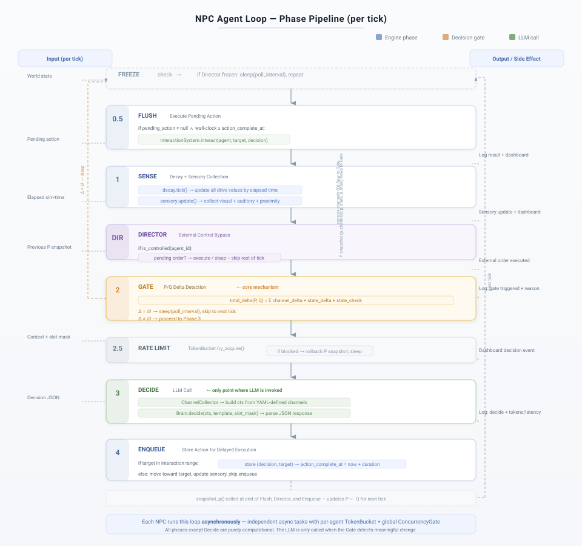

# AgentWorld Async

<p align="center">
  <b>A Social Emergence Laboratory Powered by Language Models</b>
</p>

<p align="center">
  
  
  <a href="README.zh.md"></a>
</p>

---

## Architecture

<p align="center">
  
</p>

The architecture is organized around an **ontological boundary**: the Engine Layer knows only quantities — positions, values, timestamps. The Agent Layer, consisting of independent LLM instances with strictly isolated context windows, interprets those quantities into meaning. No engine component carries semantic awareness. No labels. No summaries. No judgments.

### NPC Pipeline

<p align="center">
  
</p>

Each NPC runs an independent async loop through seven phases per tick. The LLM is invoked **only at Phase 3 (Decide)**, and only when Phase 2 (Gate) detects a meaningful change in the agent's perception.

---

## Core Question

> If the infrastructure understood nothing — not "cooperation," not "negotiation," not "trust" — could these behaviors still arise from autonomous agents interpreting raw facts?

Every AI system today distributes meaning across its stack: the database knows what a "user" is, the API knows what "authentication" means, the agent framework knows what "delegation" implies.

AgentWorld makes the opposite choice: **all meaning lives exclusively in the LLM**. The engine — the entire non-LLM infrastructure — tracks numbers, positions, and event counts. It never produces a label, a summary, or a judgment. It is a **physics engine for facts**, not a platform for actions. This single architectural decision enables questions that other frameworks cannot ask.

---

## Key Mechanisms

### P/Q Delta Gate — Information-Theoretic Adaptive Cognition

Each agent maintains a prior-state snapshot **P** and compares it against current sensory state **Q** on every tick. The LLM is invoked only when `Δ(P, Q) ≠ ∅` — something in the agent's perception has actually changed — or when a staleness timeout fires.

This is **content-driven**, not time-driven. In a static environment, LLM call count is bounded by the number of change events, not by agent count × time steps. The system scales with environmental activity, not with simulation duration — a property no existing agent framework pursues.

### Spatial Affordance — Gibsonian Perception as Architectural Constraint

Agents perceive only entities within configurable sensory radii. Information flow between agents is not message-routed — it is **spatially constrained**. Two agents can interact only if they are within each other's interaction radius. Space is a **structural variable** that shapes social dynamics: change zone topology or perception radii, and emergent behavior changes accordingly.

### Homeostatic Autonomy — Drive-Driven Continuous Behavior

Each agent maintains a need vector with per-dimension decay rates. These values are exposed to the LLM as context, not as imperative rules — the engine never suggests what to do about a high drive value. The LLM performs **autonomous attention allocation**: given raw numbers, it must determine which need deserves action.

All drives are structurally identical — same decay mechanism, same value range, same interface. There is no engine-level priority hierarchy. The agent must construct its own value ordering every tick, making priority construction itself an observable behavioral variable.

### Causal Hierarchy — Seven Primitives, Composable Actions

All state mutations pass through exactly **7 abstract primitives**: `edge_delta`, `attr_delta`, `spatial_spawn`, `spatial_despawn`, `spatial_relocate`, `abs_node_add`, `abs_node_remove`. These are semantically null graph operations. Domain-specific actions (eat, forge, trade) are **compositions** of these primitives, declared in YAML, executed via name-based routing with zero operation-name branching in engine code.

This constitutes a **two-layer causal structure**: the macro layer (physical actions meaningful to the LLM) compiles deterministically to the micro layer (primitive graph mutations). Changing worlds means changing the macro-layer definitions, not the engine.

### Cognitive Heterogeneity — Slot-Masked Prompt Assembly

Each agent's prompt template is assembled from configurable slots, individually enabled or disabled per agent via YAML-defined slot groups. One agent might receive a consistency-check slot; another might not. One might see a novelty-seeking trait; another might see a caution trait.

This creates **heterogeneous cognitive profiles** from identical engine infrastructure — enabling controlled experiments where cognitive diversity is the independent variable.

---

## Comparison with Existing Frameworks

| Property | AutoGen / CrewAI | LangGraph | Generative Agents (Park et al.) | AgentWorld |
|---|---|---|---|---|
| **Paradigm** | Task orchestration | DAG workflow | Simulated town | Emergence laboratory |
| **LLM invocation** | Every turn | Graph-driven | Fixed interval | Δ-driven (on change) |
| **Spatial constraint** | None | None | Sandbox engine | Configurable radii |
| **Info asymmetry** | Prompt convention | None | Proximity-based | Architecturally guaranteed |
| **Action model** | Flat tool calls | Node functions | Predefined verbs | 7-primitive causal hierarchy |
| **Ablation support** | No | No | No | Per-component toggle |
| **External intervention** | No | Human breakpoints | No | Director (5 permission levels) |
| **Coordination semantics** | Built-in | Graph semantics | None | Zero (no coordination layer) |

Existing frameworks encode social semantics into coordination; AgentWorld studies what happens when coordination has **no** social semantics. This is not a limitation — it is the experimental variable.

---

## Causal Traceability

Each architectural component is independently toggleable, enabling **ablation studies** that no single-LLM or tightly-coupled framework can support:

- **Remove self-reflection**: compare behavior with and without the multi-step introspection pipeline, holding all else constant
- **Constrain perception**: reduce sensory radii to limit information flow — a direct manipulation of structural parameters, not a narrative instruction
- **Strip direction markers**: remove speech-addressee labels, measuring whether agents distinguish directed communication from ambient noise
- **Vary cognitive profiles**: compare homogeneous vs. heterogeneous slot configurations across identical worlds

Observed behavioral changes can only come from the variable changed — the basic condition of experimental science.

---

## Project Structure

```
├── main.py                     Single entry point — world-agnostic
├── config/                     YAML-driven configuration (zero hardcoded engine values)
│   ├── world.yaml              World definition (entities, zones, drives)
│   ├── prompts.yaml            Prompt templates, slots, output schemas
│   ├── abstract_primitives.yaml Engine primitive definitions
│   ├── channels.yaml           Data channel definitions for prompt assembly
│   ├── layer_registry.yaml     Entity layer type registry
│   ├── item_registry.yaml      Item type definitions
│   ├── slot_groups.yaml        Attention slot group configuration
│   └── worlds/                 World-specific interface definitions
├── src/
│   ├── core/                   Engine infrastructure (zero-semantics state machines)
│   │   ├── world.py            World model, entity loading, lifecycle
│   │   ├── graph.py            Abstract graph engine (7 primitives)
│   │   ├── mcp_engine.py       Interface routing (zero op-name branching)
│   │   ├── delta_gate.py       Gating change detection
│   │   ├── clock.py            Simulation clock
│   │   ├── spatial_grid.py     Spatial hash grid
│   │   ├── lifecycle.py        Entity spawn/despawn management
│   │   ├── alias_registry.py   O(1) name-to-ID resolution
│   │   ├── affinity.py         Agent-to-agent directed edge graph
│   │   ├── director.py         External agent control interface
│   │   ├── session.py          Session management with memory persistence
│   │   └── persistence.py      State persistence
│   ├── agent/                  Agent cognitive systems
│   │   ├── brain.py            LLM decision interface
│   │   ├── drives.py           Drive attribute model
│   │   ├── memory.py           Episodic memory buffer
│   │   └── sensory_memory.py   Sensory channel storage
│   ├── layers/                 Composable entity layers (visual, auditory, interaction, agent)
│   ├── systems/                Engine systems (decay, interaction, sensory)
│   ├── prompt/                 Prompt assembly (assembler, loader)
│   ├── channel.py              Channel-driven context collection
│   ├── loop.py                 Main agent loop (phase pipeline)
│   ├── worlds/                 World-specific logic (e.g., Witcher NPC actions)
│   ├── llm/                    LLM client abstraction + concurrency control
│   ├── gateway/                External communication gateway
│   ├── cli/                    CLI command implementation
│   ├── frontend_shared/        Shared frontend data structures
│   ├── eval/                   Evaluation framework with plugin metrics
│   ├── logger/                 Structured logging
│   └── telemetry/              Observability
├── dashboard/                  Web monitoring dashboard
├── visual/                     Pixel visualization frontend
├── studio/                     Studio tooling
├── experiments/                Experiment configurations
└── tests/                      Test suite
```

---

## Quick Start

```bash
pip install -r requirements.txt

# Validate configuration
python main.py --validate-config

# Run simulation
python main.py --runtime 180 --world config/world.yaml

# Run with web dashboard
python main.py --dashboard 8766

# Run with visualization
python main.py --visual 8767

# Generate evaluation report
python main.py --eval-report data/logs/trace.sqlite3 --output report.json
```

**CLI Options:**

| Option | Description |
|---|---|
| `--runtime N` | Simulation duration (seconds) |
| `--world PATH` | World configuration file path |
| `--validate-config` | Validate YAML configuration without running |
| `--dashboard PORT` | Launch web monitoring dashboard |
| `--visual PORT` | Launch pixel visualization frontend |
| `--eval-report FILE` | Generate evaluation report from trace |
| `--output PATH` | Save evaluation output |
| `--verbose [PATH]` | Enable verbose engine logging |

---

## Configuration

All system behavior is configured through YAML files in `config/`. The engine has no hardcoded values.

| File | Purpose |
|---|---|
| `world.yaml` | World zones, entities, layers, traits, drive attributes, time scale |
| `prompts.yaml` | Prompt templates as composable slots, system prompts, output JSON schemas |
| `abstract_primitives.yaml` | Engine primitives with parameter specs and `expose_to_llm` visibility gating |
| `channels.yaml` | Communication channel definitions between engine and prompt assembly |
| `layer_registry.yaml` | Entity layer types with Python class mappings and defaults |
| `slot_groups.yaml` | Attention slot groupings enabling heterogeneous agent cognitive profiles |
| `llm.yaml` | LLM provider configuration (models, endpoints, API keys) |

---

## License

MIT
