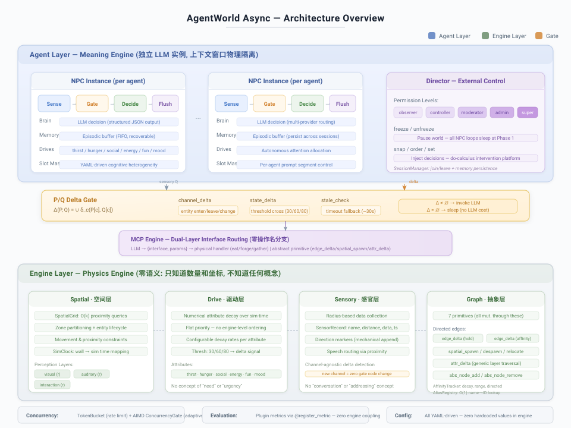

# AgentWorld Async

<p align="center">
  <b>以语言模型为实验对象的社交涌现实验室</b>
</p>

<p align="center">
  
  
  <a href="README.md"></a>
</p>

---

## 架构

<p align="center">
  
</p>

架构围绕一条**本体论边界**展开：引擎层只知道量——位置、数值、时间戳。代理层由独立的 LLM 实例组成，上下文窗口严格物理隔离，将量解释为意义。引擎组件不携带任何语义意识。没有标签。没有摘要。没有判断。

---

## 核心问题

> 如果基础设施什么都不理解——不理解"合作"，不理解"谈判"，不理解"信任"——这些行为还能从自主代理解读原始事实中涌现吗？

所有现有 AI 系统将意义分布在技术栈的各层：数据库知道什么是"用户"，API 知道什么是"认证"，Agent 框架知道什么是"委派"。

AgentWorld 做了相反的选择：**所有意义仅存在于 LLM 中**。引擎——整个非 LLM 基础设施——只追踪数字、位置和事件计数。它从不产出标签、摘要或判断。它是**事实的物理引擎**，不是行动的平台。这个唯一的架构决策使其他框架无法提出的问题成为可能。

---

## 核心机制

### P/Q Delta Gate — 信息论自适应认知

每个 agent 维护一个先验快照 **P**，每轮与当前感官状态 **Q** 进行比较。仅当 `Δ(P, Q) ≠ ∅`（即感知中确实发生了变化）或过期超时触发时，才调用 LLM。

这是**内容驱动**而非时间驱动的。静态环境下，LLM 调用次数受限于变化事件数，而非 agent 数量 × 时间步数。系统随环境活动量而非模拟时长扩展——这是现有 agent 框架无人追求的性质。

### Spatial Affordance — 吉布森可供性

Agent 只能感知可配置感官半径内的实体。Agent 之间的信息流不是消息路由——它是**受空间约束的**。两个 agent 只有同时处于对方的交互半径内才能交互。空间是**塑造社会动力学的结构变量**：改变区域拓扑或感知半径，涌现行为随之变化。

### Homeostatic Autonomy — 内稳态自主行为

每个 agent 维护需求向量，各维度有独立衰变率。数值作为上下文暴露给 LLM，而非命令式规则——引擎从不暗示高驱动值应该做什么。LLM 执行**自主注意力分配**：面对原始数字，它必须决定哪个需求值得行动。

所有需求在结构上完全平等——相同的衰减机制、相同的值域、相同的修改接口。没有引擎级的优先级层级。agent 必须每轮自行构建价值排序，使优先级构建本身成为可观察的行为变量。

### Causal Hierarchy — 七原语因果层级

所有状态变更必须经过恰好 **7 个抽象原语**：`edge_delta`、`attr_delta`、`spatial_spawn`、`spatial_despawn`、`spatial_relocate`、`abs_node_add`、`abs_node_remove`。这是语义为空的图操作。领域特定动作（吃、锻造、交易）是这些原语的**组合**，通过 YAML 声明，引擎以纯名称路由执行，零操作名分支。

这构成了**双层因果结构**：宏观层（LLM 理解的有意义动作）确定性地编译为微观层（原语图变更）。换一个世界就是换一组宏观层定义，引擎不变。

### Cognitive Heterogeneity — 槽位认知异质性

每个 agent 的 prompt 模板由可配置槽位组装而成，可通过 YAML 定义的槽位组按 agent 单独启用或禁用。一个 agent 可能收到一致性检查槽位，另一个不会；一个看到追求新奇特质，另一个看到谨慎特质。

这从相同的引擎基础设施中创造了**异质认知画像**——使受控实验成为可能，其中认知多样性是独立变量。

---

## 同类对比

| 属性 | AutoGen / CrewAI | LangGraph | Generative Agents (Park et al.) | AgentWorld |
|---|---|---|---|---|
| **范式** | 任务编排 | DAG 工作流 | 模拟小镇 | 涌现实验室 |
| **LLM 调用** | 每轮全量 | 图驱动 | 固定间隔 | Δ 驱动（变化时） |
| **空间约束** | 无 | 无 | 沙盒引擎 | 可配置半径 |
| **信息不对称** | 提示约定 | 无 | 基于邻近 | 架构保证 |
| **动作模型** | 扁平工具调用 | 节点函数 | 预定义动作 | 7原语因果层级 |
| **消融实验** | 不支持 | 不支持 | 不支持 | 逐组件开关 |
| **外部干预** | 无 | 人工断点 | 无 | Director (5 权限级) |
| **协调语义** | 内建 | 图语义 | 无 | 零（无协调层） |

现有框架将社会语义编码进协调层；AgentWorld 研究的恰恰是当协调层**没有**社会语义时会发生什么。这不是限制——这是实验变量。

---

## 因果可追溯性

每个架构组件可独立开关，使**消融研究**成为可能——单一 LLM 或紧耦合框架无法做到：

- **移除自省**：比较有/无多步自省管道的行为，保持其他条件不变
- **限制感知**：缩小感官半径以约束信息流——直接操纵结构参数，而非叙事指令
- **去除方向标记**：剥离语音对象标签，测量 agent 能否区分定向沟通与环境噪音
- **改变认知画像**：在相同世界中比较同质 vs. 异质槽位配置

观察到的行为变化只能来自你改变的变量——实验科学的基本条件。

---

## 项目结构

```
├── main.py                     单一入口 — 世界无关
├── config/                     YAML 驱动配置（引擎零硬编码值）
│   ├── world.yaml              世界定义 (实体、区域、驱动)
│   ├── prompts.yaml            提示模板、槽位、输出模式
│   ├── abstract_primitives.yaml 引擎原语定义
│   ├── channels.yaml           提示装配的数据通道定义
│   ├── layer_registry.yaml     实体层类型注册
│   ├── item_registry.yaml      物品类型定义
│   ├── slot_groups.yaml        注意力槽位组配置
│   └── worlds/                 世界特定接口定义
├── src/
│   ├── core/                   引擎基础设施 (零语义状态机)
│   │   ├── world.py            世界模型、实体加载、生命周期
│   │   ├── graph.py            抽象图引擎 (7 原语)
│   │   ├── mcp_engine.py       接口路由 (零操作名分支)
│   │   ├── delta_gate.py       门控变化检测
│   │   ├── clock.py            模拟时钟
│   │   ├── spatial_grid.py     空间哈希网格
│   │   ├── lifecycle.py        实体生成/消灭管理
│   │   ├── alias_registry.py   O(1) 名称到 ID 解析
│   │   ├── affinity.py         Agent 间有向边图
│   │   ├── director.py         外部 Agent 控制接口
│   │   ├── session.py          会话管理与记忆持久化
│   │   └── persistence.py      状态持久化
│   ├── agent/                  代理认知系统
│   │   ├── brain.py            LLM 决策接口
│   │   ├── drives.py           驱动属性模型
│   │   ├── memory.py           情节记忆缓冲
│   │   └── sensory_memory.py   感官通道存储
│   ├── layers/                 可组合实体层 (视觉/听觉/交互/代理)
│   ├── systems/                引擎系统 (衰减/交互/感官)
│   ├── prompt/                 提示装配 (assembler, loader)
│   ├── channel.py              通道驱动上下文采集
│   ├── loop.py                 主代理循环 (阶段管道)
│   ├── worlds/                 世界特定逻辑 (如 Witcher NPC 动作)
│   ├── llm/                    LLM 客户端抽象 + 并发控制
│   ├── gateway/                外部通信网关
│   ├── cli/                    CLI 命令实现
│   ├── frontend_shared/        共享前端数据结构
│   ├── eval/                   评估框架 (插件式指标)
│   ├── logger/                 结构化日志
│   └── telemetry/              可观测性
├── dashboard/                  Web 监控仪表盘
├── visual/                     像素可视化前端
├── studio/                     Studio 工具
├── experiments/                实验配置
└── tests/                      测试套件
```

---

## 快速开始

```bash
pip install -r requirements.txt

# 验证配置
python main.py --validate-config

# 运行模拟
python main.py --runtime 180 --world config/world.yaml

# 带 Web 仪表盘运行
python main.py --dashboard 8766

# 带可视化前端运行
python main.py --visual 8767

# 生成评估报告
python main.py --eval-report data/logs/trace.sqlite3 --output report.json
```

**命令行选项:**

| 选项 | 说明 |
|---|---|
| `--runtime N` | 模拟时长 (秒) |
| `--world PATH` | 世界配置文件路径 |
| `--validate-config` | 仅验证 YAML 配置，不运行 |
| `--dashboard PORT` | 启动 Web 监控仪表盘 |
| `--visual PORT` | 启动像素可视化前端 |
| `--eval-report FILE` | 从 trace 生成评估报告 |
| `--output PATH` | 保存评估输出 |
| `--verbose [PATH]` | 启用详细引擎日志 |

---

## 配置

所有系统行为通过 `config/` 下的 YAML 文件配置。引擎无任何硬编码值。

| 文件 | 用途 |
|---|---|
| `world.yaml` | 世界区域、实体、层、特质、驱动属性、时间尺度 |
| `prompts.yaml` | 提示模板（可组合槽位）、系统提示、输出 JSON schema |
| `abstract_primitives.yaml` | 引擎原语定义，含参数规约和 `expose_to_llm` 可见性门控 |
| `channels.yaml` | 引擎与提示装配之间的数据通道定义 |
| `layer_registry.yaml` | 实体层类型，Python 类映射与默认值 |
| `slot_groups.yaml` | 注意力槽位分组，实现异质 agent 认知画像 |
| `llm.yaml` | LLM 提供商配置（模型、端点、API 密钥） |

---

## 许可证

MIT
