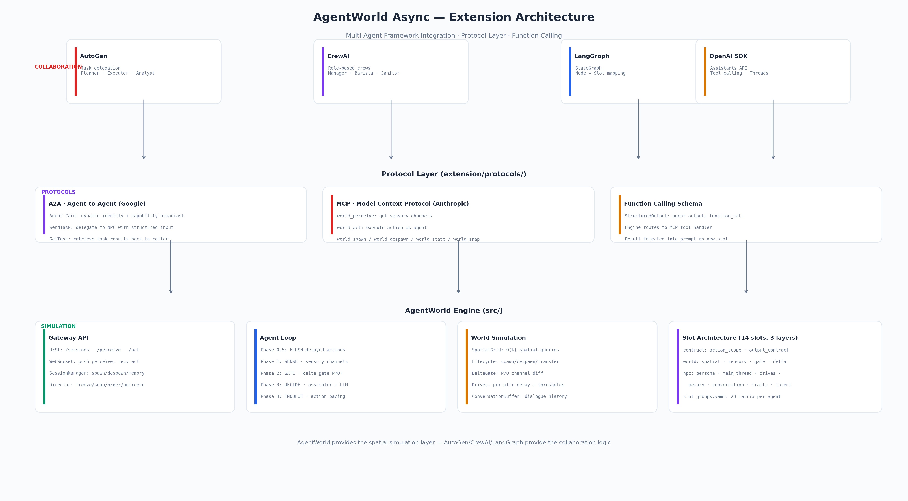

# AgentWorld Async — Extension Layer

<p align="center">
  
</p>

## What This Is

The `extension/` folder contains **everything needed to integrate AgentWorld into a production multi-agent system** — protocols, framework adapters, function calling, and end-to-end use cases.

**It does not modify `src/` at all.** Deleting `extension/` has zero impact on the core simulation engine.

## Why AgentWorld + Frameworks?

| Feature | AutoGen | CrewAI | LangGraph | **+ AgentWorld** |
|---------|---------|--------|-----------|------------------|
| Task delegation | ✅ | ✅ | ✅ | Spatial task execution |
| Role-based agents | ✅ | ✅ | ✅ | Zone-aware NPC discovery |
| State graph flow | ❌ | ❌ | ✅ | **Slot → Node mapping** |
| Physics simulation | ❌ | ❌ | ❌ | ✅ SpatialGrid + duration |
| Sensory perception | ❌ | ❌ | ❌ | ✅ view_radius + hearing |
| Autonomous co-agents | ❌ | ❌ | ❌ | ✅ KL gate + drives |

**AgentWorld adds the physical layer other frameworks lack.** AutoGen decides *what* to do — AgentWorld determines *where*, *how long*, and *who is nearby*.

## Directory Structure

```
extension/
├── README.md                    # You are here
├── ARCHITECTURE.md               # Full architecture documentation
│
├── protocols/                    # Standard protocol implementations
│   ├── mcp/                      # Model Context Protocol (Anthropic)
│   │   ├── README.md
│   │   └── server.py
│   └── a2a/                      # Agent-to-Agent (Google)
│       ├── README.md
│       ├── agent_card.py
│       └── handler.py
│
├── frameworks/                   # Framework-specific adapters
│   ├── autogen/
│   │   ├── README.md
│   │   └── witcher_investigation.py  # Runnable demo
│   ├── crewai/
│   │   ├── README.md
│   │   └── coffee_shop.py
│   └── langgraph/
│       ├── README.md
│       └── slot_mapping.py       # 14 slots → LangGraph nodes
│
├── function_calling/             # Structured tool calling
│   ├── README.md
│   └── schema.py
│
├── use_cases/                    # End-to-end walkthroughs
│   ├── witcher_investigation.md
│   ├── coffee_shop_management.md
│   └── cross_world_agent.md
│
└── img/                          # Architecture diagrams
    ├── ARCHITECTURE.png
    ├── MCP_FLOW.png
    └── A2A_FLOW.png
```

## Quick Start

### Run AgentWorld as an MCP Server

```bash
python -m extension.protocols.mcp.server --port 8765 --world config/world.yaml
```

Any MCP-compatible host can now call:
- `world_perceive(agent_id)` → get sensory channels
- `world_act(agent_id, decision)` → execute an action
- `world_spawn(entity_def)` / `world_despawn(agent_id)` → runtime entity management

### AutoGen + AgentWorld Integration

```python
# extension/frameworks/autogen/witcher_investigation.py
from extension.protocols.a2a import A2AClient

# AutoGen agents delegate tasks to AgentWorld NPCs via A2A
planner.delegate("geralt", task="investigate_griffin_tracks")
executor.assign("vesemir", task="prepare_potions")
```

See `extension/frameworks/autogen/README.md` for full walkthrough.

### Slot Architecture in LangGraph

```python
# extension/frameworks/langgraph/slot_mapping.py
# Maps AgentWorld's 14 YAML slots to LangGraph StateGraph nodes
# condition → conditional_edge
# template → node prompt
# slot order → graph topology
```

See `extension/frameworks/langgraph/README.md` for the philosophical mapping.

## Protocol Comparison

| | MCP | A2A |
|------|-----|-----|
| **Standard** | Anthropic | Google |
| **Semantics** | Agent ↔ Tool | Agent ↔ Agent |
| **AgentWorld scenario** | External host calls AgentWorld tools | External agent finds and delegates to NPCs |
| **Discovery** | Tool list | Agent Card (dynamic, per-NPC) |
| **Implementation** | `extension/protocols/mcp/server.py` | `extension/protocols/a2a/` |
| **Status** | Designed, not yet implemented | Designed, not yet implemented |

## Implementation Priority

1. **MCP server** — smallest scope, immediately usable with any MCP host
2. **Function calling schema** — agent outputs structured `function_call` JSON
3. **AutoGen + Witcher demo** — highest demo value
4. **A2A protocol** — agent ↔ agent standard communication
5. **CrewAI + Coffee Shop demo** — role-based crew management
6. **LangGraph SVA mapping** — paper-quality validation of slot architecture

## License

MIT — same as AgentWorld Async.
